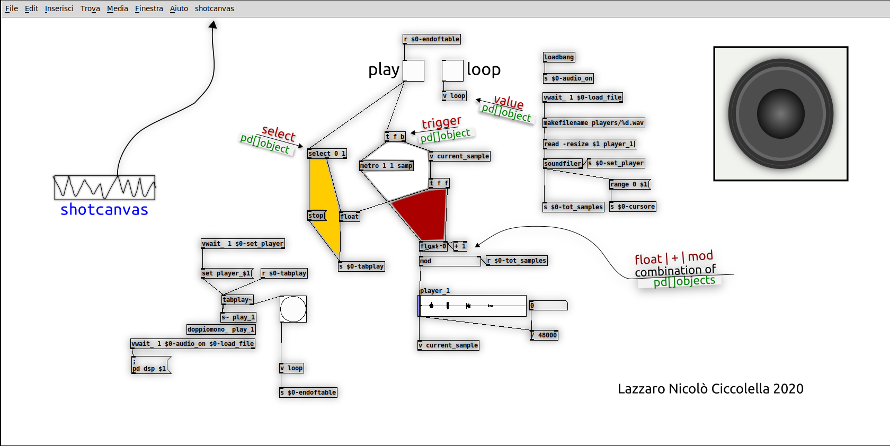

shotcanvas
==========

Puredata plugin. This plugin is designed to use a PNG image as background of a pd patch. You can also create a PNG snapshot of your patch.
Programming language: Tcl/Tk.

Dependency: Img (a Tk extension library) 
> The plugin is designed to work with decent qualityes images, so the [Tk Img library](http://tkimg.sourceforge.net/) must be in your system.

Plugin features and uses
-----------------
- CREATE PNG (export png)
- CREATE BACKGROUND (import png)

CREATE PNG (*export PNG*)
-------------------------
> Create a **PNG** screnshot of a focused patchwindow (only the canvas, not the frame) 

A new menu item (**shotcanvas**) appear in the main pd menu (it is active only in patchwindows).
Clicking on "shotcanvas" you screenshot the focused patch. Screenshot in **PNG** format include everything in the patch: objects, wires etc. as you see it (the patch can be in edit mode or not).

You will find the screenshot in <your home dir>/Pd/img/.
>You can change this behavior by editing the value of "img_folder" variable on the top of the main plugin file (shotcanvas-plugin.tcl).

Also a **SVG** file is created, you can find it in the same directory.
>NB, **the SVG file is a simple container** of the png image, it does not contain paths, shapes or other vector elements.

Finally the procedure opens the SVG file with **inkscape** (you must have it already installed).
>you can change program by editing the value of "**edit_program**" variable on top of the main plugin file (shotcanvas-plugin.tcl).

CREATE BACKGROUND (*import PNG*)
------------------------------
>Loads a **PNG** image as background into the **patchwindow canvas** with offset 0 0 (the upper/left corner of the image will be in the upper/left corner of the patch canvas).

NB The image **is not loaded ON a patchwindow canvas like a graphic (or standard) pd object**.

The image become the canvas background, so once imported you cant access at all its properties. If you don't want to see it animore, simply rename or delete the image.

The image will be loaded only under these conditions:
- must be a **PNG**
- Its name must be **identical to the pd file name (except in the extension)**
- The image file must be in the **<your_home_dir>/Pd/img/** folder.
example: if tou wanth a background for mypatch.pd your background must be <your_home_dir>/Pd/img/mypatch.png

Install
-------

Copy [shotcanvas-plugin.tcl](shotcanvas-plugin.tcl) and [shotcanvas-svgcontainer.tcl](shotcanvas-svgcontainer.tcl) to <your home directory>/pd-externals.
> this may change, please, refer to the PD documentation.

basically:
1) shotcanvas-plugin.tcl and shotcanvas-svgcontainer.tcl must be on the same level in a directory where pd looks
2) don't rename the files

Author
-----
Lazzaro Nicolò Ciccolellla

License
-------
*shotcanvas* is *open source software*, see: [LICENSE](LICENSE)

>Have fan

Reference:
----------
- [puredata](https://puredata.info/)
- [Tcl Tk](https://www.tcl.tk/)
