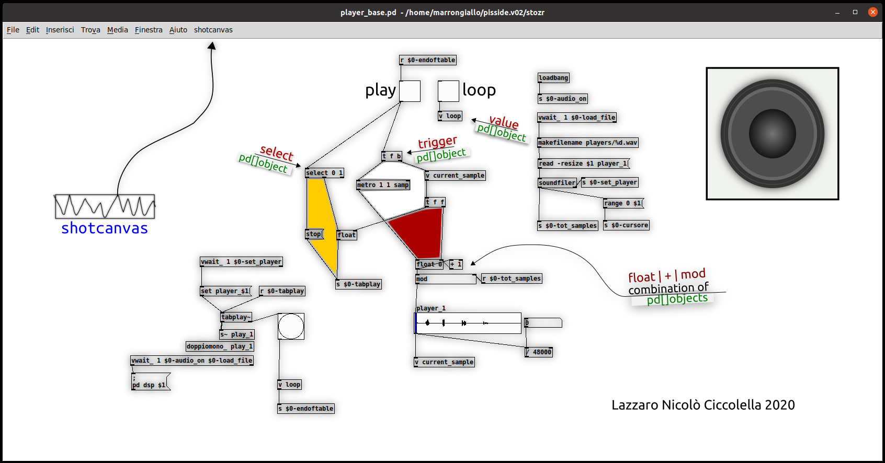

shotcanvas
==========

Puredata plugin. This plugin is designed to use a PNG image as background of a pd patch. You can also create a PNG snapshot of your patch.

Plugin features and uses
-----------------
- CREATE PNG (export png)
- CREATE BACKGROUND (import png)

Dependency: **IMG**
> The plugin is designed to work with decent qualityes images, so the IMG library of tk is required in your system (debian/ubuntu: libtk-img).

CREATE PNG (*import PNG*)
-------------------------
> Create png with all the content of a focused patchwindow (only the canvas, not the frame) 

Shotcanvas places a menu item (**shotcanvas**) in the main pd menu (it is active only in patchwindows).
Clicking on "shotcanvas" you export an image (**png**) of the patch with everything are on it, objects, wires etc. as it appears to your eyes  (the patch can be in edit mode or not).

You will find the image in **(your_home_dir)/Pd/img/**.
>You can change this behavior by editing the value of "img_folder" variable in the first lines of the main plugin file.

An **SVG** file is also created.
>NB, **the SVG file is a simple container** of the png image, it does not contain paths, shape or other vector elements.

If you have installed ***inkscape***, it automatically will open with your svg file loaded inside.
>you can change program by editing the value of "**edit_program**" variable in the first lines of the main plugin file.

CREATE BACKGROUND (*import PNG*)
------------------------------
>Loads a **PNG** image into the **patchwindow canvas** starting with offset 0 0.
The upper/left corner of the image will be in the upper/left corner of the patch canvas.

NB The image **is not loaded ON a patchwindow canvas like a graphic object** (as example: like [image] object from pd-extended) but it become the canvas background, so once imported the image you will not be able to change its position or all other its properties. When you don't want to see it animore, simply rename or delete the image.

The image will be loaded only under these conditions:
- must be a **PNG**
- Its name must be **identical to the pd file name (except in the extension)**
- The image file must be in the **(your_home_dir)/Pd/img/** folder (you can change this..)

Programming language
--------------------
tcl TK

Install
-------

Copy **shotcanvas-plugin.tcl** and **shotcanvas-svgcontainer.tcl** to (your home directory)/pd-externals.
> this may change so refer to the PD documentation.

basically:
1) shotcanvas-plugin.tcl and shotcanvas-svgcontainer.tcl must be on the same level in a directory where pd looks
2) don't rename the files

Author
-----
Lazzaro Nicolò Ciccolellla

License
-------
*shotcanvas* is *open source software*, see: [LICENSE](LICENSE)

>Have fan

Reference:
----------
[puredata](https://puredata.info/)
